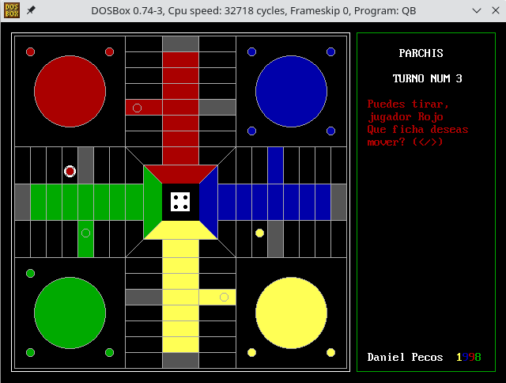
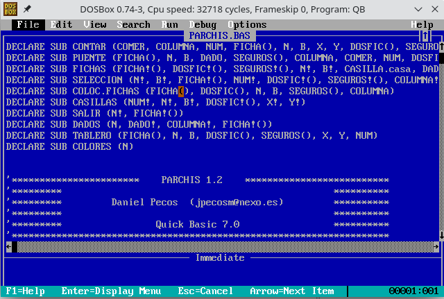
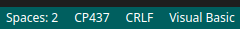

# PARCHIS

In this blog post you will find a more detailed explanation of what this project is: https://danielpecos.com/2021/11/06/parchis-the-reason-why-i-am-a-developer/

## WTF is this??

This was my very first program, when I teached my self how to write BASIC code using Microsoft QuickBasic back in 1998.

This is how the dev environment looked like:

And yes, it was really painful to code in that editor, but back then it was just fine for an eager to learn teenager.

## How do I run this ancient piece of ...?

In order to run / compile this programm, I've got the best results with `dosbox` emulator and installing the original QuickBasic that I used to code in.

Have a look to the cheatsheet I've gathered [here](docs/dosbox.md).

## Is it possible to even edit it?

Yes, but probably keeping the same file encoding that MS-DOS used is important:

- MS-DOS file encoding was named "DOS latin1"
- In Visual Studio Code, selecting "DOS (CP 437)" almost perfectly loaded all the code.

## For real? Does it even work?

Have a look ;)

