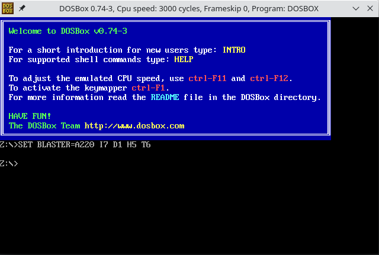

# dosbox

## QuickBasic setup

You can easily find online a ZIP file with the original setup, like for example:

https://winworldpc.com/product/quickbasic/45

Once you've downloaded it:

1. Unzip the installation file, and copy contents of `DISK1` and `DISK2` into `~/dosbox/a`
2. Launch `dosbox`
3. Mount a: `mount a dosbox/a`
4. Mount c: `mount c dosbox/c`
5. Switch to floppy drive: `a:`
6. Launch QB setup: `setup.exe`

## Loading code into QuickBasic

## Useful shortcuts

- Enter / exit fullscreen: <kbd>Alt</kbd> + <kbd>Enter</kbd>
- Recover mouse pointer: <kbd>Ctrl</kbd> + <kbd>F10</kbd>
- Increase CPU speed: <kbd>Ctrl</kbd> + <kbd>F12</kbd>
- Lower CPU speed: <kbd>Ctrl</kbd> + <kbd>F11</kbd>
- Take a screenshot: <kbd>Ctrl</kbd> + <kbd>F5</kbd>
